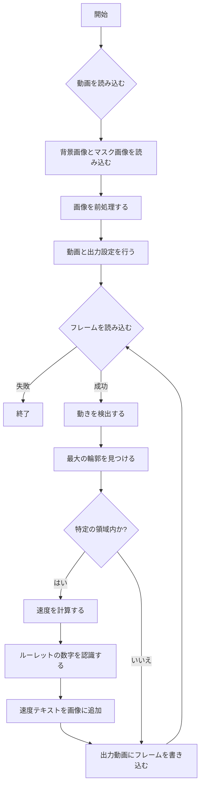

# RouletteCracker

ルーレットの動画からデータを解析するためのコードです。動画内でルーレットの球の動きを検出し、特定の領域を通過する速度や、ルーレットの数字を認識します。

## 機能

このプロジェクトには、以下の主要な関数が含まれています。

- `load_images`: 背景画像とマスク画像を読み込みます。
- `preprocess_images`: 画像を前処理します。具体的には、マスク画像を二値化し、背景画像をグレースケールに変換してマスクを適用します。
- `setup_video_io`: 入力動画と出力動画の設定を行います。
- `detect_movement`: 背景と現在のフレームの差分を取り、変化があった部分を検出します。
- `find_largest_contour`: 検出された変化の中で最大の輪郭を見つけます。
- `calculate_speed`: 特定の領域を通過するオブジェクトの速度を計算します。
- `process_video`: 動画を処理するメインの関数です。動きを検出し、速度を計算し、ルーレットの数字を認識します。
- `find_numbers_in_image`: 画像から指定された数字を認識し、その中心座標を返します。
- `save_roulette_data`: 分析結果をCSVファイルに保存します。

## 処理の流れ

以下のフローチャートは、プログラムの処理の流れを示しています。



## 使用例

### 必要なファイル

- 入力動画: `../media/videos/RouletteVideo_20240313.mp4`
- 出力動画: `../media/result/result_{現在の日時}/detect_{入力ビデオのファイル名}.mp4`
- 背景画像: `../media/frame/RouletteVideo_20240224/frame_0.jpg`
- マスク画像: `../media/frame/RouletteVideo_20240224/frame_mask_2.jpg`

### パラメータ

- `rect_top_left`: 検出領域の左上の座標 (デフォルト: (1670, 550))
- `rect_bottom_right`: 検出領域の右下の座標 (デフォルト: (1800, 650))
- `diameter_cm`: オブジェクトの直径 (デフォルト: 50 cm)

### 実行方法

プログラムを実行するには、以下のコマンドを使用します。

```
python main.py
```

出力は ../media/result/result_{現在の日時}/detect_{入力ビデオのファイル名}.mp4 に保存されます。また、分析結果のCSVファイルは ../media/csv/analyze_roulette_data_{動画の名前}_{実行時刻}.csv に保存されます。

## 構築メモ
プロジェクトの構築過程、作業ログ、課題一覧などの詳細は、docs/memo.mdに記載されています。このドキュメントでは、プロジェクトの構築に関する作業とその実施日をリスト形式で管理しています。新しい機能の追加やバグ修正の履歴もここで確認できます。


