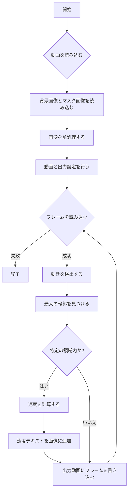

# RouletteCracker

ルーレットを解析するためのコードです。動画内のオブジェクトの動きを検出し、特定の領域を通過する速度を計算します。

## 機能

このプロジェクトには、以下の主要な関数が含まれています。

- `load_images`: 背景画像とマスク画像を読み込みます。
- `preprocess_images`: 画像を前処理します。具体的には、マスク画像を二値化し、背景画像をグレースケールに変換してマスクを適用します。
- `setup_video_io`: 入力動画と出力動画の設定を行います。
- `detect_movement`: 背景と現在のフレームの差分を取り、変化があった部分を検出します。
- `find_largest_contour`: 検出された変化の中で最大の輪郭を見つけます。
- `calculate_speed`: 特定の領域を通過するオブジェクトの速度を計算します。
- `process_video`: 動画を処理するメインの関数です。動きを検出し、速度を計算します。

## 処理の流れ

以下のフローチャートは、プログラムの処理の流れを示しています。



## 使用例

### 必要なファイル

- 入力動画: `../media/videos/ball.mp4`
- 出力動画: `../media/result/detected_ball_video.mp4`
- 背景画像: `../media/images/frame_279.jpg`
- マスク画像: `../media/images/frame_mask.jpg`

### パラメータ

- `rect_top_left`: 矩形の左上の座標 (デフォルト: (350, 70))
- `rect_bottom_right`: 矩形の右下の座標 (デフォルト: (400, 100))
- `diameter_cm`: オブジェクトの直径 (デフォルト: 50 cm)

### 実行方法

プログラムを実行するには、以下のコマンドを使用します。

```bash
python main.py
```

出力は ../media/result_{現在の日時}/detected_ball_video.mp4 に保存されます。